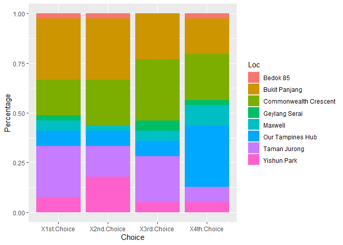
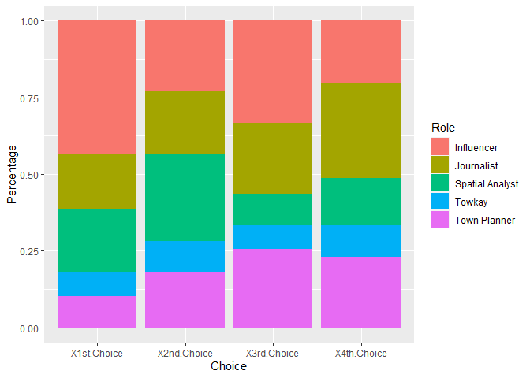
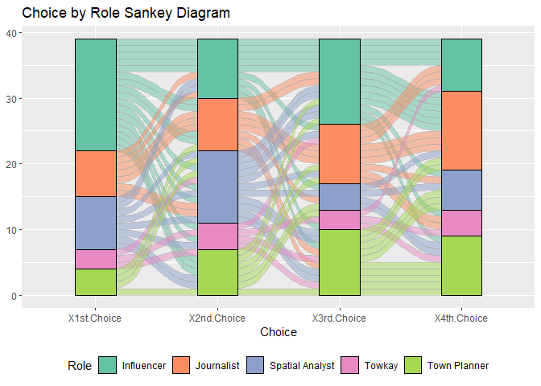
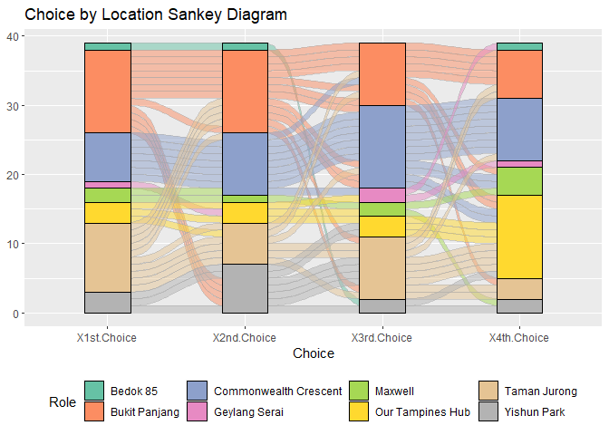
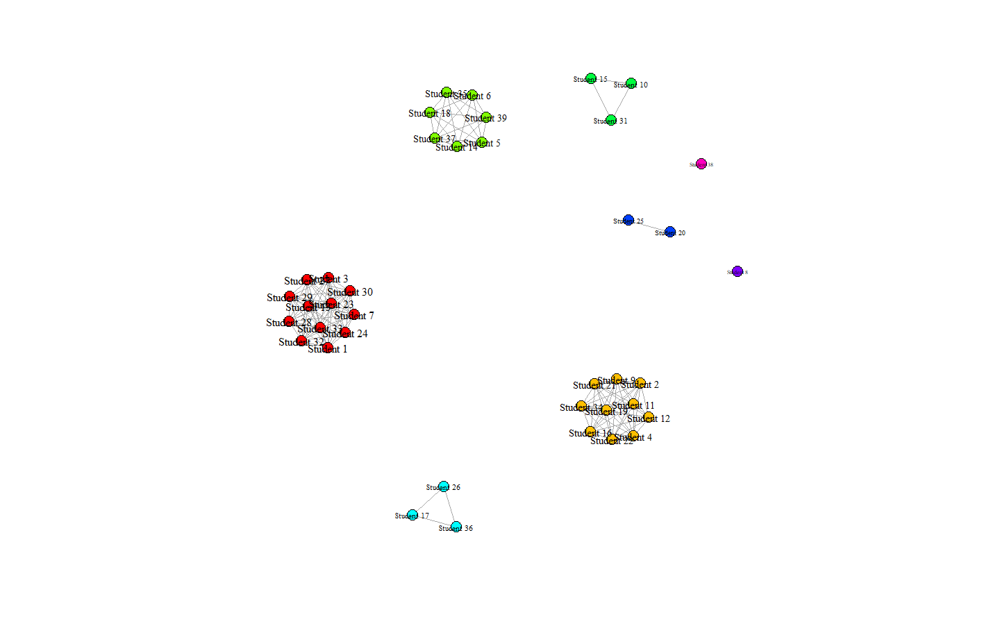
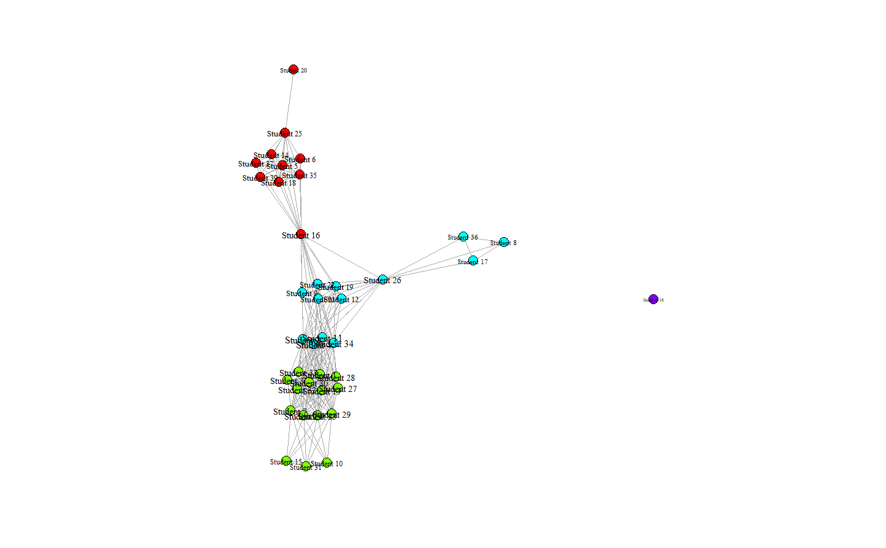
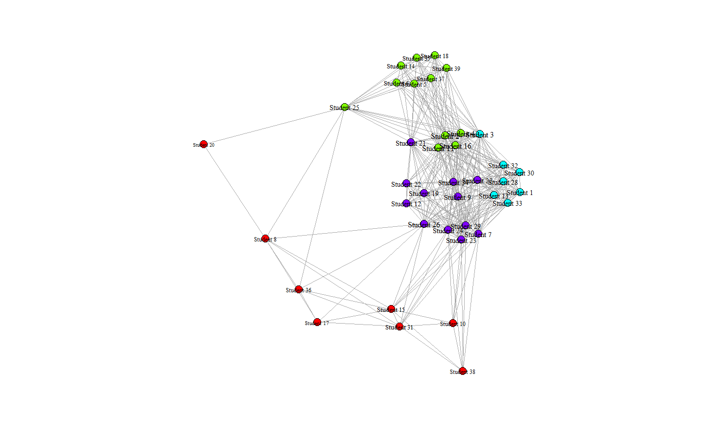
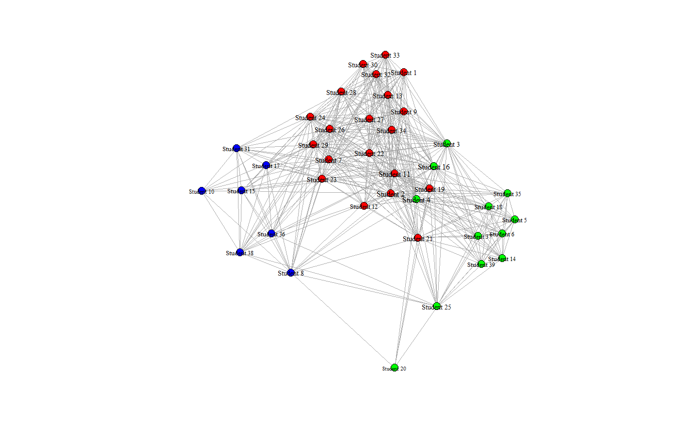
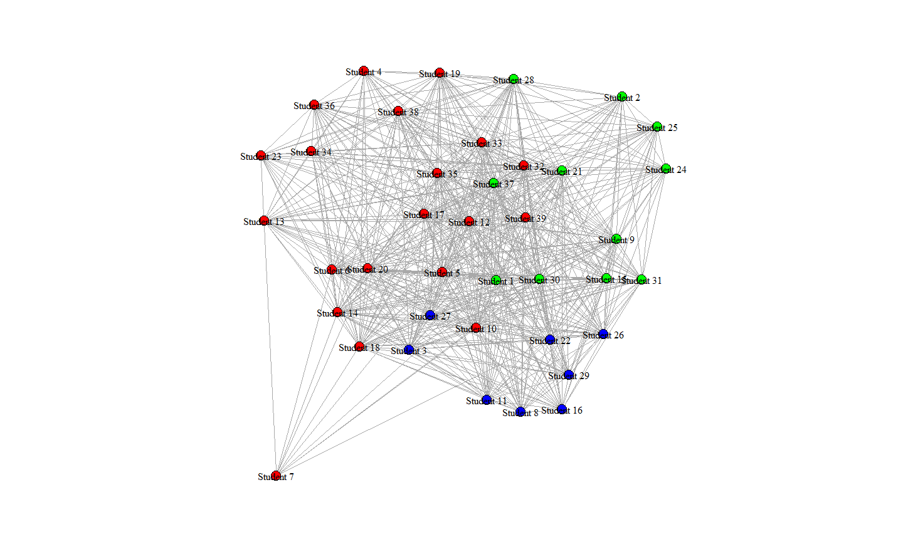

Analysis of Academic Preferences (Sankey, SNA)
================

Blogpost:
<https://ryantanyiwei.wixsite.com/blog/analysis-of-academic-preferences>

Clear

``` r
rm(list = ls())
```

``` r
library(igraph)
library(tidyverse)
library(dplyr)
library(ggplot2)
library(rmarkdown)
library(reshape2)
library(ggalluvial)
```

Read survey data

``` r
s <- read.csv("surveydata.csv")
```

Divide into Dataframes by Location, by Role

``` r
s_byloc = s 

for (i in 1:nrow(s_byloc)){
  str1 = s_byloc[i,]$X1st.Choice
  s_byloc[i,]$X1st.Choice = strsplit(str1, "[/]")[[1]][1]
  str2 = s_byloc[i,]$X2nd.Choice
  s_byloc[i,]$X2nd.Choice = strsplit(str2, "[/]")[[1]][1]
  str3 = s_byloc[i,]$X3rd.Choice
  s_byloc[i,]$X3rd.Choice = strsplit(str3, "[/]")[[1]][1]
  str4 = s_byloc[i,]$X4th.Choice
  s_byloc[i,]$X4th.Choice = strsplit(str4, "[/]")[[1]][1]
}

s_byrole = s

for (i in 1:nrow(s_byrole)){
  str1 = s_byrole[i,]$X1st.Choice
  s_byrole[i,]$X1st.Choice = sub(".*/ ", "", str1) 
  str2 = s_byrole[i,]$X2nd.Choice
  s_byrole[i,]$X2nd.Choice = sub(".*/ ", "", str2) 
  str3 = s_byrole[i,]$X3rd.Choice
  s_byrole[i,]$X3rd.Choice = sub(".*/ ", "", str3) 
  str4 = s_byrole[i,]$X4th.Choice
  s_byrole[i,]$X4th.Choice = sub(".*/ ", "", str4) 
}
```

Bar Graph by Location

``` r
s1 = s_byloc %>% select(-1) %>%
  select(Name, everything())

s2 = melt(s1,
     id.vars = "Name",
     variable.name = "Choice",
     value.name = "Loc")

s3 = rename(count(s2, Choice, Loc), Percentage = n)

ggplot(data = s3, aes(x = Choice, y = Percentage, fill = Loc)) +
  geom_bar(position = "fill", stat = 'identity')
```

<!-- -->

Bar Graph by Role

``` r
s1 = s_byrole %>% select(-1) %>%
  select(Name, everything())

s2 = melt(s1,
     id.vars = "Name",
     variable.name = "Choice",
     value.name = "Role")

s3 = rename(count(s2, Choice, Role), Percentage = n)

ggplot(data = s3, aes(x = Choice, y = Percentage, fill = Role)) +
  geom_bar(position = "fill", stat = 'identity')
```

<!-- -->

Sankey Role

``` r
s1 = s_byrole %>% select(-1) %>%
  select(Name, everything())

s2 = melt(s1,
     id.vars = "Name",
     variable.name = "Choice",
     value.name = "Role")

s2$Role = as.factor(s2$Role)

ggplot(s2, aes(x = Choice, stratum = Role, alluvium = Name, fill = Role, label = Role)) +
  scale_fill_brewer(type = "qual", palette = "Set2") +
  geom_flow(stat = "alluvium", lode.guidance = "rightleft", color = "darkgray") +
  geom_stratum() +
  theme(legend.position = "bottom") +
  ggtitle("Choice by Role Sankey Diagram")
```

<!-- -->

Sankey Location

``` r
s1 = s_byloc %>% select(-1) %>%
  select(Name, everything())

s2 = melt(s1,
     id.vars = "Name",
     variable.name = "Choice",
     value.name = "Loc")

s2$Role = as.factor(s2$Loc)

ggplot(s2, aes(x = Choice, stratum = Role, alluvium = Name, fill = Role, label = Loc)) +
  scale_fill_brewer(type = "qual", palette = "Set2") +
  geom_flow(stat = "alluvium", lode.guidance = "rightleft", color = "darkgray") +
  geom_stratum() +
  theme(legend.position = "bottom") +
  ggtitle("Choice by Location Sankey Diagram")
```

<!-- -->

``` r
head(s1)
```

    ##        Name           X1st.Choice           X2nd.Choice           X3rd.Choice
    ## 1 Student 1         Bukit Panjang         Bukit Panjang         Bukit Panjang
    ## 2 Student 2          Taman Jurong         Bukit Panjang Commonwealth Crescent
    ## 3 Student 3         Bukit Panjang         Bukit Panjang Commonwealth Crescent
    ## 4 Student 4          Taman Jurong         Bukit Panjang Commonwealth Crescent
    ## 5 Student 5 Commonwealth Crescent Commonwealth Crescent Commonwealth Crescent
    ## 6 Student 6 Commonwealth Crescent Commonwealth Crescent Commonwealth Crescent
    ##             X4th.Choice
    ## 1         Bukit Panjang
    ## 2      Our Tampines Hub
    ## 3 Commonwealth Crescent
    ## 4               Maxwell
    ## 5 Commonwealth Crescent
    ## 6 Commonwealth Crescent

``` r
head(s2)
```

    ##        Name      Choice                   Loc                  Role
    ## 1 Student 1 X1st.Choice         Bukit Panjang         Bukit Panjang
    ## 2 Student 2 X1st.Choice          Taman Jurong          Taman Jurong
    ## 3 Student 3 X1st.Choice         Bukit Panjang         Bukit Panjang
    ## 4 Student 4 X1st.Choice          Taman Jurong          Taman Jurong
    ## 5 Student 5 X1st.Choice Commonwealth Crescent Commonwealth Crescent
    ## 6 Student 6 X1st.Choice Commonwealth Crescent Commonwealth Crescent

SNA by location bipartite (1 Choices)

``` r
s1 = s_byloc %>% select(-1,-3,-4,-5) %>%
  select(Name, everything())

s2 = melt(s1,
     id.vars = "Name",
     variable.name = "Choice",
     value.name = "Loc")

el = s2 %>% select(-2) 
bi <- graph_from_data_frame(el, directed = F)

V(bi)$type <- V(bi)$name %in% unique(el$Name)

P <- bipartite_projection(bi)
g <- P$proj2
k <- degree(g)

#----------------------------------------------------#

# community structure
library("RColorBrewer")
# coloring: http://www.sthda.com/english/wiki/colors-in-r

comm <- cluster_fast_greedy(g)

#comm <- cluster_edge_betweenness(g)
# col <- brewer.pal(length(comm), name = "RdBu")
col <- rainbow(length(comm))
k <- degree(g)
b <- betweenness(g)
lay <- layout_with_fr(g)
plot(g,
     vertex.label.cex = sqrt(k)/max(sqrt(k))/2 + .5,
     vertex.label.color = 'black',
     vertex.color = col[comm$membership],
     vertex.size = 5,
     layout = lay
)
```

<!-- -->

SNA by location bipartite (2 Choices)

``` r
s1 = s_byloc %>% select(-1,-4,-5) %>%
  select(Name, everything())

library(reshape2)
s2 = melt(s1,
     id.vars = "Name",
     variable.name = "Choice",
     value.name = "Loc")

el = s2 %>% select(-2) 
bi <- graph_from_data_frame(el, directed = F)

V(bi)$type <- V(bi)$name %in% unique(el$Name)

P <- bipartite_projection(bi)
g <- P$proj2
k <- degree(g)

#----------------------------------------------------#

# community structure
library("RColorBrewer")
# coloring: http://www.sthda.com/english/wiki/colors-in-r

comm <- cluster_fast_greedy(g)

#comm <- cluster_edge_betweenness(g)
# col <- brewer.pal(length(comm), name = "RdBu")
col <- rainbow(length(comm))
k <- degree(g)
b <- betweenness(g)
lay <- layout_with_fr(g)
plot(g,
     vertex.label.cex = sqrt(k)/max(sqrt(k))/2 + .5,
     vertex.label.color = 'black',
     vertex.color = col[comm$membership],
     vertex.size = 5,
     layout = lay
)
```

<!-- -->

SNA by location bipartite (3 Choices)

``` r
s1 = s_byloc %>% select(-1,-5) %>%
  select(Name, everything())

library(reshape2)
s2 = melt(s1,
     id.vars = "Name",
     variable.name = "Choice",
     value.name = "Loc")

el = s2 %>% select(-2) 
bi <- graph_from_data_frame(el, directed = F)

V(bi)$type <- V(bi)$name %in% unique(el$Name)

P <- bipartite_projection(bi)
g <- P$proj2
k <- degree(g)

#----------------------------------------------------#

# community structure
library("RColorBrewer")
# coloring: http://www.sthda.com/english/wiki/colors-in-r

comm <- cluster_fast_greedy(g)

#comm <- cluster_edge_betweenness(g)
# col <- brewer.pal(length(comm), name = "RdBu")
col <- rainbow(length(comm))
k <- degree(g)
b <- betweenness(g)
lay <- layout_with_fr(g)
plot(g,
     vertex.label.cex = sqrt(k)/max(sqrt(k))/2 + .5,
     vertex.label.color = 'black',
     vertex.color = col[comm$membership],
     vertex.size = 5,
     layout = lay
)
```

<!-- -->

SNA by location bipartite (4 Choices)

``` r
s1 = s_byloc %>% select(-1) %>%
  select(Name, everything())

library(reshape2)
s2 = melt(s1,
     id.vars = "Name",
     variable.name = "Choice",
     value.name = "Loc")


el = s2 %>% select(-2) 
bi <- graph_from_data_frame(el, directed = F)

V(bi)$type <- V(bi)$name %in% unique(el$Name)

P <- bipartite_projection(bi)
g <- P$proj2
k <- degree(g)

#----------------------------------------------------#

# community structure
library("RColorBrewer")
# coloring: http://www.sthda.com/english/wiki/colors-in-r

comm <- cluster_fast_greedy(g)

#comm <- cluster_edge_betweenness(g)
# col <- brewer.pal(length(comm), name = "RdBu")
col <- rainbow(length(comm))
k <- degree(g)
b <- betweenness(g)
lay <- layout_with_fr(g)
plot(g,
     vertex.label.cex = sqrt(k)/max(sqrt(k))/2 + .5,
     vertex.label.color = 'black',
     vertex.color = col[comm$membership],
     vertex.size = 5,
     layout = lay
)
```

<!-- -->

SNA by role bipartite

``` r
s1 = s_byrole %>% select(-1) %>%
  select(Name, everything())

library(reshape2)
s2 = melt(s1,
     id.vars = "Name",
     variable.name = "Choice",
     value.name = "Role")

el = s2 %>% select(-2) 


bi <- graph_from_data_frame(el, directed = F)

V(bi)$type <- V(bi)$name %in% unique(el$Name)

P <- bipartite_projection(bi)
g <- P$proj2
k <- degree(g)

#----------------------------------------------------#
# community structure
library("RColorBrewer")
# coloring: http://www.sthda.com/english/wiki/colors-in-r

comm <- cluster_fast_greedy(g)
#comm <- cluster_edge_betweenness(g)
# col <- brewer.pal(length(comm), name = "RdBu")
col <- rainbow(length(comm))
k <- degree(g)
b <- betweenness(g)
lay <- layout_with_fr(g)
plot(g,
     vertex.label.cex = 1,
     vertex.label.color = 'black',
     vertex.color = col[comm$membership],
     vertex.size = 5,
     layout = lay
)
```

<!-- -->
